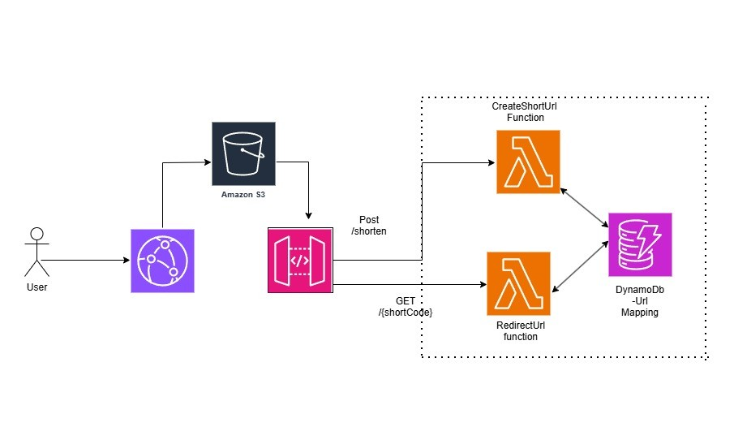

# URL Shortener — Serverless AWS Architecture

A production-grade serverless URL shortener built on AWS.  
Paste a long URL, get a short one. Click it, get redirected.

🔗 Live demo: https://d13hdpglfxyllm.cloudfront.net

---

## Architecture



**Request flow:**
```
User → CloudFront → S3 (static React app)
                 → API Gateway → Lambda → DynamoDB
```

---

## Tech Stack

| Layer | Service | Why |
|---|---|---|
| Frontend | React (Vite) | Fast, lightweight SPA |
| CDN | AWS CloudFront | Global edge caching, HTTPS, OAC |
| Static hosting | AWS S3 (private) | Stores React build, OAC only |
| API | AWS API Gateway | REST routing, proxy integration |
| Business logic | AWS Lambda (Python) | Serverless, scales to zero |
| Database | AWS DynamoDB | Key-value lookups, pay per request |
| Auth/Access | AWS IAM | Least privilege roles |

---

## Features

- Shorten any URL to a clean 6-character code
- 301 redirect on click — browser follows instantly
- Fully serverless — zero idle cost, scales automatically
- Private S3 bucket — only accessible via CloudFront OAC
- HTTPS everywhere via CloudFront + ACM certificate
- CORS locked to CloudFront origin only

---

## Architecture Decisions

### Why Lambda over EC2?
URL shortener traffic is spiky and unpredictable — 
nobody hammers a URL shortener 24/7. Lambda scales 
from zero to thousands of concurrent executions 
automatically and costs nothing at zero traffic. 
EC2 would sit idle billing hourly even when nobody 
is using the app.

### Why DynamoDB over RDS?
The data model is a pure key-value lookup —
`shortCode → longUrl`. DynamoDB's partition key 
model is a perfect fit. No joins, no schema 
migrations, no connection pooling. Pay-per-request 
billing means ~$0 at low traffic.

### Why CloudFront in front of S3?
Two reasons:
1. S3 alone serves from a single region. CloudFront 
   caches at 400+ edge locations globally.
2. Enables Origin Access Control (OAC) — S3 bucket 
   is completely private. Zero public access. 
   The only way to reach the frontend is through 
   CloudFront.

### Why not ElastiCache?
DynamoDB's single-digit millisecond latency is 
sufficient at this scale. ElastiCache has no free 
tier (~$12/month idle cost) and adds VPC complexity.

At scale (millions of redirects/day) I would introduce 
ElastiCache Redis in front of DynamoDB. The redirect 
operation is read-heavy and immutable — Redis with a 
1-hour TTL would absorb ~85% of DynamoDB reads, 
significantly reducing cost and latency.

### Why not Route 53?
CloudFront provides a working HTTPS endpoint out of 
the box. For production I would add Route 53 with 
an Alias record pointing to the CloudFront distribution 
for a clean custom domain and health checks.

---

## Lambda Functions

### createShortUrl
```
POST /shorten
Body: { "longUrl": "https://example.com" }
Returns: { "shortUrl": "https://d13hdpglfxyllm.cloudfront.net/aB3xKp" }
```

Flow:
1. Parse `longUrl` from request body
2. Generate random 6-character alphanumeric code
3. Store `shortCode → longUrl` in DynamoDB
4. Return full short URL to client

### redirect
```
GET /{shortCode}
Returns: 301 redirect to original URL
```

Flow:
1. Extract `shortCode` from path parameters
2. Lookup `shortCode` in DynamoDB
3. Return 301 with `Location` header set to `longUrl`
4. Browser follows redirect automatically

---

## IAM — Least Privilege

Lambda execution role has exactly two DynamoDB permissions:
```json
{
  "Action": [
    "dynamodb:PutItem",
    "dynamodb:GetItem"
  ],
  "Resource": "arn:aws:dynamodb:us-east-1:ACCOUNT_ID:table/UrlMappings"
}
```

No `DeleteItem`, no `Scan`, no `UpdateItem`.  
Scoped to the specific table ARN — not `*`.

---

## Project Structure
```
url-shortener/
├── README.md
├── frontend/
│   ├── src/
│   │   ├── App.jsx
│   │   ├── components/
│   │   │   └── InputComponent.jsx
│   │   └── api/
│   │       └── api-server.js
│   ├── package.json
│   └── vite.config.js
└── lambda/
    ├── createShortUrl/
    │   └── lambda_function.py
    └── redirect/
        └── lambda_function.py
```

---

## Local Development
```bash
# clone the repo
git clone https://github.com/yourusername/url-shortener.git
cd url-shortener/frontend

# install dependencies
npm install

# create .env file
echo "VITE_API_URL=https://lyslwokumc.execute-api.us-east-1.amazonaws.com/prod" > .env

# run locally
npm run dev
```

---

## Deployment

**Frontend:**
```bash
npm run build
aws s3 sync ./dist s3://urlshortnerfrontend --delete
aws cloudfront create-invalidation \
  --distribution-id YOUR_DISTRIBUTION_ID \
  --paths "/*"
```

**Lambda:**  
Deploy via AWS Console or AWS CLI.  
Environment variables required:
```
BASE_URL        = https://d13hdpglfxyllm.cloudfront.net
DYNAMODB_TABLE_NAME = UrlMappings
ALLOWED_ORIGIN  = https://d13hdpglfxyllm.cloudfront.net
```

---

## Cost Analysis

| Service | Pricing model | Monthly cost |
|---|---|---|
| Lambda | Per invocation | ~$0.00 |
| DynamoDB | Per request | ~$0.00 |
| API Gateway | Per million calls | ~$0.00 |
| S3 | Per GB stored | ~$0.00 |
| CloudFront | Per GB transferred | ~$0.00 |
| **Total** | | **~$0.00** |

Entire stack runs at effectively zero cost at low traffic.  
No servers running 24/7. No idle billing.

---

## What I'd Add Next

- **Route 53** — custom domain via Alias record to CloudFront
- **ElastiCache Redis** — caching layer at scale, ~85% cache hit rate on redirects
- **WAF** — rate limiting per IP to prevent abuse
- **Click analytics** — DynamoDB atomic counter on each redirect
- **URL expiry** — DynamoDB TTL attribute, auto-deletes after set time
- **CI/CD** — GitHub Actions auto-deploy Lambda + S3 on every push
- **IaC** — entire infrastructure as AWS CDK code

---
